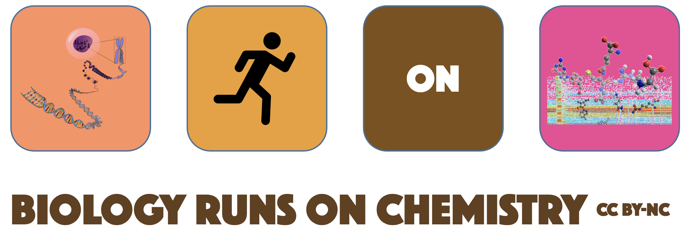

# Computational Metabolomics

The Shuzhao Li lab at [The Jackson Laboratory for Genomic Medicine, Connecticut](https://www.jax.org/about-us/our-campuses-and-communities) combine experimental approaches with computational algorithms that identify pathway patterns and integrate chemical reactions and biology. 
High-resolution mass spectrometry measures the metabolome, lipidome and small molecules of dietary, microbial and environmental origins. 
This information fills a major gap between genome and environment, revolutionizing biochemistry with broad applications to human health. 
